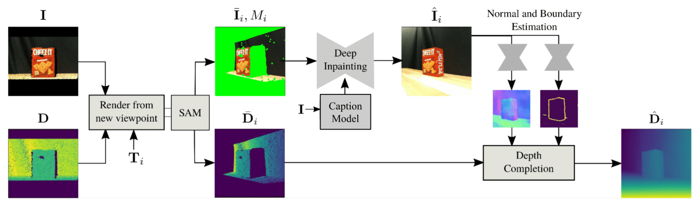

# <strong>RIC: Rotate-Inpaint-Complete for Generalizable Scene Reconstruction</strong>


[[Project Page]](https://samsunglabs.github.io/RIC-project-page/) [[ArXiv]](https://arxiv.org/pdf/2307.11932.pdf)
<br>
[Isaac Kasahara](https://kasai2020.github.io/), [Shubham Agrawal](https://www.agshubh.com),
[Selim Engin](https://ksengin.github.io/), [Nikhil Chavan-Dafle](https://nikhilcd.com),
[Shuran Song](https://scholar.google.com/citations?user=5031vK4AAAAJ&hl=en&oi=ao), [Volkan Isler](https://www-users.cse.umn.edu/~isler/)
<br>
[Samsung AI Center, New York](https://research.samsung.com/aicenter_ny)





## Table of contents:
1. [Setup environment](#setup-environment)
2. [Inference](#inference)
3. [Citation](#citation)

## Setup environment

1. **Make a new directory**
    ```bash
    mkdir RIC_Project
    cd RIC_Project
    ```

2. **Install depth completion repo from [ClearGrasp](https://github.com/Shreeyak/cleargrasp#setup) in this folder**

    Follow steps 1, 2, and 4 on their page. (You do not need their data or models)


3. **Clone our repo inside RIC_Project folder**

    Navigate back to RIC_Project folder
    ```bash
    git clone https://github.com/SamsungLabs/RIC.git
    ```

    Folder structure should look like this:
    ```bash
    RIC_Project                # Root folder
    ├── RIC                    # Code for RIC (This Repo)
    └── ClearGrasp             # Code for depth completion (ClearGrasp)
    ```

4. **Install our python dependencies**

    ```bash
    cd RIC
    python3.8 -m venv venv
    source venv/bin/activate
    pip install -r requirements.txt
    ```

5. **Download weights for depth completion**

    Download the weights for [surface normal](https://github.com/SamsungLabs/RIC/releases/download/v1.0/surface_normals.pth) and [occlusion boundary](https://github.com/SamsungLabs/RIC/releases/download/v1.0/occlusion_boundaries.pth) estimation and place them in the RIC/weights/ folder.

6. **Install HOPE Dataset**

    Navigate to the [HOPE dataset page](https://github.com/swtyree/hope-dataset) and follow the [download instructions](https://github.com/swtyree/hope-dataset#download).

7. **Add OpenAI API Key**

    If you don't have one already, follow these instructions:
    - First make an [OpenAI account](https://openai.com/blog/openai-api) if you don't have one already
    - Next go here https://platform.openai.com/api-keys
    - Click on create new secret key
    - Copy the key

    Once you have the key, paste the key on line 28 of "inference_hope_dataset.py"

## Inference

1. **To generate predictions:**
    ```bash
    python3 inference_hope_dataset.py --data_dir "path/to/hope-dataset/hope_video/" --write_file_root "results/"
    ```

2. **To evaluate predictions:**
    ```bash
    python3 evaluate_results.py --results_dir "results/"
    ```


## Acknowledgement
RIC code makes use of [ClearGrasp](https://github.com/Shreeyak/cleargrasp)
and [Dalle-2](https://openai.com/dall-e-2) implementations. We
sincerely thanks the authors for providing their implementations.

## Citation
```
@misc{kasahara2023ric,
      title={RIC: Rotate-Inpaint-Complete for Generalizable Scene Reconstruction}, 
      author={Isaac Kasahara and Shubham Agrawal and Selim Engin and Nikhil Chavan-Dafle and Shuran Song and Volkan Isler},
      year={2023},
      eprint={2307.11932},
      archivePrefix={arXiv},
      primaryClass={cs.CV}
}
```

